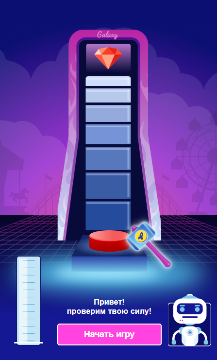

# 🎮 Galaxy Test Task — Rubin Game

Привет! 👋  
Это тестовое задание, реализованное в виде мини-игры на React.

---

## 🚀 Демо

👉 Игру можно запустить по ссылке:  
🔗 https://tilekbeki.github.io/galaxy-rubin-game/

---

## 🖼 Preview



---

## 🛠 Технологии

Проект разработан с использованием:

- ⚛️ React
- 🧩 Redux Toolkit
- 🎨 CSS Modules (module.css)
- 📦 JavaScript (ES6+)

---

## 🎯 Описание

Игроку необходимо нажать кнопку в нужный момент, чтобы:
- поймать максимальное значение шкалы
- выбить приз (рубин 💎)

Логика игры включает:
- анимацию шкалы
- расчет силы удара
- определение победы / поражения
- визуализацию результата

---

## 📦 Установка и запуск

```bash
npm install
npm run start
```